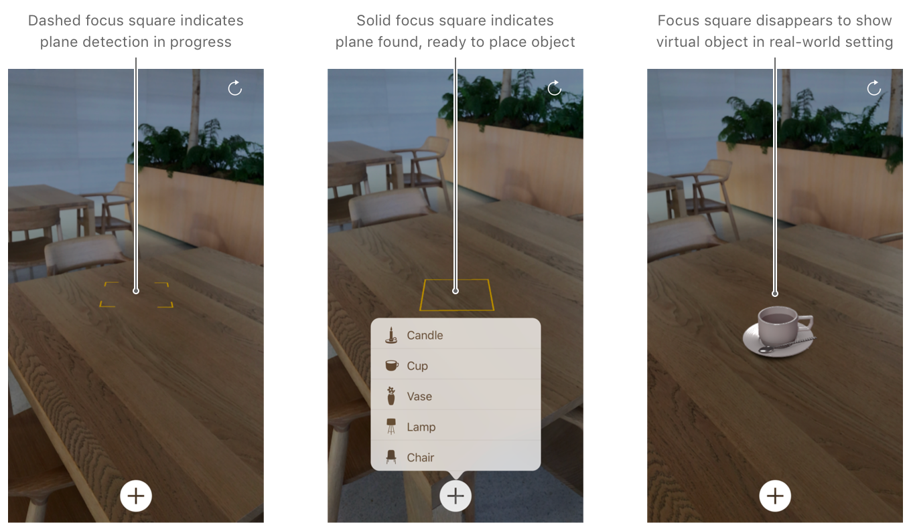
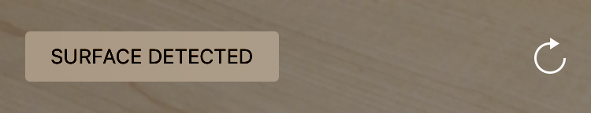

# Handling 3D Interaction and UI Controls in Augmented Reality

Follow best practices for visual feedback, gesture interactions, and realistic rendering in AR experiences.

## Overview

Augmented reality (AR) offers new ways for users to interact with real and virtual 3D content in your app. However, many fundamental principles of human interface design are still valid. Convincing AR illusions also require careful attention to 3D asset design and rendering. The [iOS Human Interface Guidelines][0] include advice on human interface principles for AR. This project shows ways to apply those guidelines and easily create immersive, intuitive AR experiences.

[0]:https://developer.apple.com/ios/human-interface-guidelines/technologies/augmented-reality/

This sample app provides a simple AR experience allowing a user to place one or more realistic virtual objects in their real-world environment, then arrange those objects using intuitive gestures. The app offers user interface cues to help the user understand the state of the AR experience and their options for interaction.

The sections below correspond to sections in [iOS Human Interface Guidelines > Augmented Reality][0], and provide details on how this sample app implements those guidelines. For more detailed reasoning on each section, see the corresponding content in the iOS Human Interface Guidelines.

## Getting Started

ARKit and this sample app require iOS 11 and a device with an A9 (or later) processor. ARKit is not available in iOS Simulator.

## Placing Virtual Objects

**Help people understand when to locate a surface and place an object.**
The [`FocusSquare`](x-source-tag://FocusSquare) class draws a square outline in the AR view, giving the user hints about the status of ARKit world tracking.



The square changes size and orientation to reflect estimated scene depth, and switches between open and closed states with a prominent animation to indicate whether ARKit has detected a plane suitable for placing an object. After the user places a virtual object, the focus square disappears, remaining hidden until the user points the camera at another surface.

**Respond appropriately when the user places an object.**
When the user chooses a virtual object to place, the sample app's [`setPosition(_:relativeTo:smoothMovement)`](x-source-tag://VirtualObjectSetPosition) method uses the [`FocusSquare`](x-source-tag://FocusSquare) object's simple heuristics to place the object at a roughly realistic position in the middle of the screen, even if ARKit hasn't yet detected a plane at that location.

``` swift
guard let cameraTransform = session.currentFrame?.camera.transform,
    let focusSquarePosition = focusSquare.lastPosition else {
    statusViewController.showMessage("CANNOT PLACE OBJECT\nTry moving left or right.")
    return
}
        
virtualObjectInteraction.selectedObject = virtualObject
virtualObject.setPosition(focusSquarePosition, relativeTo: cameraTransform, smoothMovement: false)
        
updateQueue.async {
    self.sceneView.scene.rootNode.addChildNode(virtualObject)
}
```
[View in Source](x-source-tag://PlaceVirtualObject)

This position might not be an accurate estimate of the real-world surface the user wants to place the virtual object on, but it's close enough to get the object onscreen quickly.

Over time, ARKit detects planes and refines its estimates of their position, calling the [`renderer(_:didAdd:for:)`][4] and [`renderer(_:didUpdate:for:)`][5] delegate methods to report results. In those methods, the sample app calls its [`adjustOntoPlaneAnchor(_:using:)`](x-source-tag://AdjustOntoPlaneAnchor) method to determine whether a previously placed virtual object is close to a detected plane. If so, that method uses a subtle animation to move the virtual object onto the plane, so that the object appears to be at the user's chosen position while benefiting from ARKit's refined estimate of the real-world surface at that position:

``` swift
// Move onto the plane if it is near it (within 5 centimeters).
let verticalAllowance: Float = 0.05
let epsilon: Float = 0.001 // Do not update if the difference is less than 1 mm.
let distanceToPlane = abs(planePosition.y)
if distanceToPlane > epsilon && distanceToPlane < verticalAllowance {
    SCNTransaction.begin()
    SCNTransaction.animationDuration = CFTimeInterval(distanceToPlane * 500) // Move 2 mm per second.
    SCNTransaction.animationTimingFunction = CAMediaTimingFunction(name: kCAMediaTimingFunctionEaseInEaseOut)
    position.y = anchor.transform.columns.3.y
    SCNTransaction.commit()
}
```
[View in Source](x-source-tag://AdjustOntoPlaneAnchor)

[4]:https://developer.apple.com/documentation/arkit/arscnviewdelegate/2865794-renderer
[5]:https://developer.apple.com/documentation/arkit/arscnviewdelegate/2865799-renderer

## User Interaction with Virtual Objects

**Allow people to directly interact with virtual objects using standard, familiar gestures.**
The sample app uses one-finger tap, one- and two-finger pan, and two-finger rotation gesture recognizers to let the user position and orient virtual objects. The sample code's [`VirtualObjectInteraction`](x-source-tag://VirtualObjectInteraction) class manages these gestures.

**In general, keep interactions simple.**
When dragging a virtual object (see the [`translate(_:basedOn:infinitePlane:)`](x-source-tag://DragVirtualObject) method), the sample app restricts the object's movement to the two-dimensional plane it's placed on. Similarly, because a virtual object rests on a horizontal plane, rotation gestures (see the [`didRotate(_:)`](x-source-tag://didRotate) method) spin the object around its vertical axis only, so that the object remains on the plane.

**Respond to gestures within reasonable proximity of interactive virtual objects.**
The sample code's [`objectInteracting(with:in:)`](x-source-tag://TouchTesting) method performs hit tests using the touch locations provided by gesture recognizers. By hit testing against the bounding boxes of the virtual objects, the method makes it more likely that a user touch will affect the object even if the touch location isn't on a point where the object has visible content. By performing multiple hit tests for multitouch gestures, the method makes it more likely that the user touch affects the intended object:

``` swift
for index in 0..<gesture.numberOfTouches {
    let touchLocation = gesture.location(ofTouch: index, in: view)
    
    // Look for an object directly under the `touchLocation`.
    if let object = sceneView.virtualObject(at: touchLocation) {
        return object
    }
}
        
// As a last resort look for an object under the center of the touches.
return sceneView.virtualObject(at: gesture.center(in: view))
```
[View in Source](x-source-tag://TouchTesting)

**Consider whether user-initiated object scaling is necessary.**
This AR experience places realistic virtual objects that might naturally appear in the user's environment, so preserving the intrinsic size of the objects aids realism. Therefore, the sample app doesn't add gestures or other UI to enable object scaling. Additionally, by not including a scale gesture, the sample app prevents a user from becoming confused about whether a gesture resizes an object or changes the object's distance from the camera. (If you choose to enable object scaling in your app, use a pinch gesture recognizer.)

**Be wary of potentially conflicting gestures.**
The sample code's [`ThresholdPanGesture`](x-source-tag://ThresholdPanGesture) class is a [`UIPanGestureRecognizer`][3] subclass that provides a way to delay the gesture recognizer's effect until after the gesture in progress passes a specified movement threshold. The sample code's [`touchesMoved(with:)`](x-source-tag://touchesMoved) method uses this class to let the user smoothly transition between dragging an object and rotating it during a single two-finger gesture:

``` swift
override func touchesMoved(_ touches: Set<UITouch>, with event: UIEvent) {
    super.touchesMoved(touches, with: event)
    
    let translationMagnitude = translation(in: view).length
    
    // Adjust the threshold based on the number of touches being used.
    let threshold = ThresholdPanGesture.threshold(forTouchCount: touches.count)
    
    if !isThresholdExceeded && translationMagnitude > threshold {
        isThresholdExceeded = true
        
        // Set the overall translation to zero as the gesture should now begin.
        setTranslation(.zero, in: view)
    }
}
```
[View in Source](x-source-tag://touchesMoved)

[3]:https://developer.apple.com/documentation/uikit/uipangesturerecognizer

**Make sure virtual object movements are smooth.**
The sample code's [`setPosition(_:relativeTo:smoothMovement)`](x-source-tag://VirtualObjectSetPosition) method interpolates between the touch gesture locations that result in dragging an object and a history of that object's recent positions. By averaging recent positions based on distance to the camera, this method produces smooth dragging movement without causing the dragged object to lag behind the user's gesture:

``` swift
if smoothMovement {
    let hitTestResultDistance = simd_length(positionOffsetFromCamera)
    
    // Add the latest position and keep up to 10 recent distances to smooth with.
    recentVirtualObjectDistances.append(hitTestResultDistance)
    recentVirtualObjectDistances = Array(recentVirtualObjectDistances.suffix(10))
    
    let averageDistance = recentVirtualObjectDistances.average!
    let averagedDistancePosition = simd_normalize(positionOffsetFromCamera) * averageDistance
    simdPosition = cameraWorldPosition + averagedDistancePosition
} else {
    simdPosition = cameraWorldPosition + positionOffsetFromCamera
}
```
[View in Source](x-source-tag://VirtualObjectSetPosition)

**Explore even more engaging methods of interaction.**
In an AR experience, a pan gesture—that is, moving one's finger across the device's screen—isn't the only natural way to drag virtual content to a new position. A user might also intuitively try holding a finger still against the screen while moving the device, effectively dragging the touch point across the AR scene.

The sample app supports this kind of gesture by calling its [`updateObjectToCurrentTrackingPosition()`](x-source-tag://updateObjectToCurrentTrackingPosition) method continually while a drag gesture is in progress, even if the gesture's touch location hasn't changed. If the device moves during a drag, that method calculates the new world position corresponding to the touch location and moves the virtual object accordingly.

## Entering Augmented Reality

**Indicate when initialization is occurring and involve the user.**
The sample app shows textual hints about the state of the AR session and instructions for interacting with the AR experience using a floating text view. The sample code's [`StatusViewController`](x-source-tag://StatusViewController) class manages this view, showing transient instructions that fade away after allowing the user time to read them, or important status messages that remain visible until the user corrects a problem.



## Handling Problems

**Allow people to reset the experience if it doesn’t meet their expectations.**
The sample app has a Reset button that's always visible in the upper-right corner of the UI, allowing a user to restart the AR experience regardless of its current state. See the [`restartExperience()`](x-source-tag://restartExperience) method in the sample code.

**Offer AR features only on capable devices.**
The sample app requires ARKit for its core functionality, so it defines the `arkit` key in the [`UIRequiredDeviceCapabilities`][1] section of its `Info.plist` file. When deploying the built project, this key prevents installation of the app on devices that don't support ARKit.

If your app instead uses AR as a secondary feature, use the [`ARWorldTrackingConfiguration.isSupported`][2] method to determine whether to hide features that require ARKit.

[1]:https://developer.apple.com/library/content/documentation/General/Reference/InfoPlistKeyReference/Articles/iPhoneOSKeys.html#//apple_ref/doc/uid/TP40009252-SW3
[2]:https://developer.apple.com/documentation/arkit/arconfiguration/2923553-issupported
